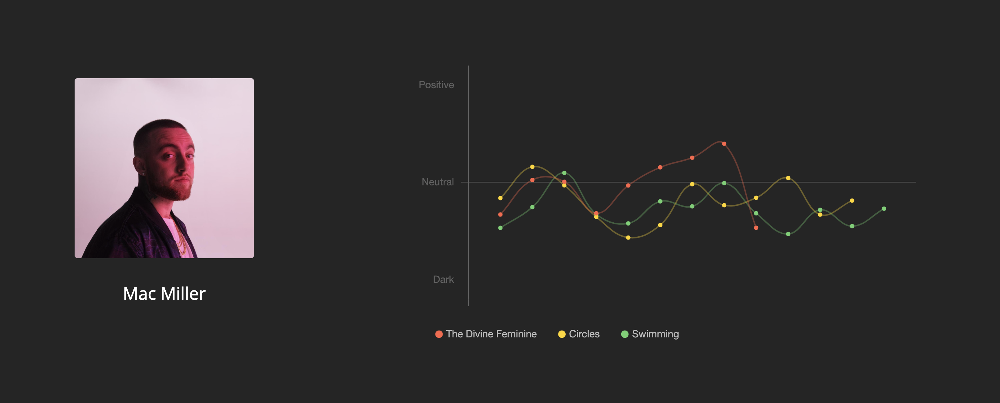

# Vibes
Track sentiment and general mood of an artist's albums



<br/>

## What is it?

Vibes analyzes the mood of any given artist's albums. Simply search the name of the artist, and it'll handle the rest. You can see how the mood of a specific album progresses, and how it compares to others. This is a work in progress, so check back every now and then for updates if you're interested. 

<br/>

## Details

Various packages and APIs are used to do this - the main ones are `Flask`, `Spotify API`, `requests`, `TextBlob` and `BeautifulSoup`. The general flow when searching for an artist is as follows.

1. Use Spotify API to get artist data
    1. Get list of albums
    2. Get list of songs for each album
    3. Get Spotify [audio features](https://developer.spotify.com/documentation/web-api/reference/tracks/get-audio-features/) for each song
2. Scrape lyrics from Genius for each song
    1. Use `TextBlob` package to get `sentiment` value of lyrics
3. Return all data in `JSON` format

`Flask` is used as the backend, and the process of getting the song lyrics is multithreaded. This way it can send/receive requests for about 60 song lyrics in about 5 - 8 seconds (reducing loading time from what would be about 45 seconds). 

The overall end `sentiment` value of the song is a combination of two data points, the `polarity` value from the lyrics using `TextBlob`, and the `valence` value of the song that Spotify gives. The value that Spotify gives isn't always accurate, which is why I'm running the sentiment analysis of lyrics to balance the value out. From there it's just a weighted sum of the two values scaled (70% weight on the valence, 30% weight on lyrics sentiment). I'm still trying to figure out the right balance, and will update it as I find better values.

Hovering over the data points in the graph will show these two data point values.

The front end is just vanilla JS, and the chart is shown using `Chart.js` (which made the whole graphing process super easy, check it out [here](https://www.chartjs.org/))

<br/>

## Usage

_NOTE:_ Since this utilizes the Spotify API, and I don't really want to expose my API keys, you'll have to create your own Spotify Developer App to use the project locally.

If you want to test this out locally:

1. Make sure `python3` is installed
2. Install required dependencies with `pip3 install -r requirements.txt`
3. Setup Spotify Developer App
    1. Create file in project root `.env`
    2. Add the Spotify app credentials as environment variables:
    ```
    CLIENT_ID={SPOTIFY_CLIENT_ID_HERE}
    CLIENT_SECRET={SPOTIFY_CLIENT_SECRET}
    ```
4. Run `python3 server.py` to start the development server

<br/>
